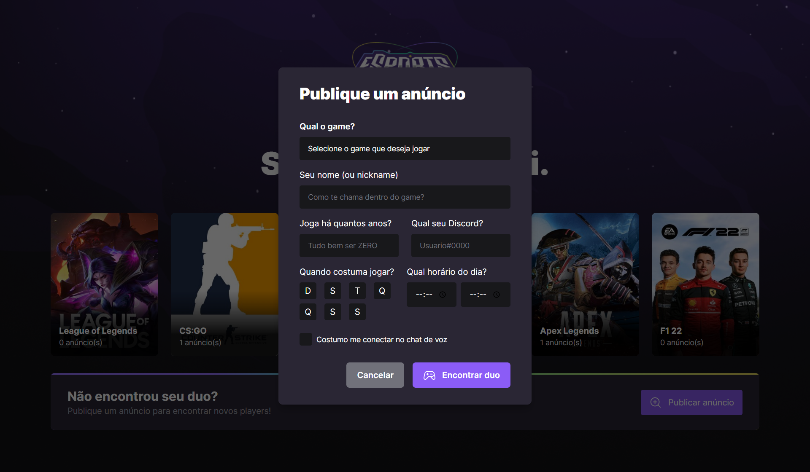
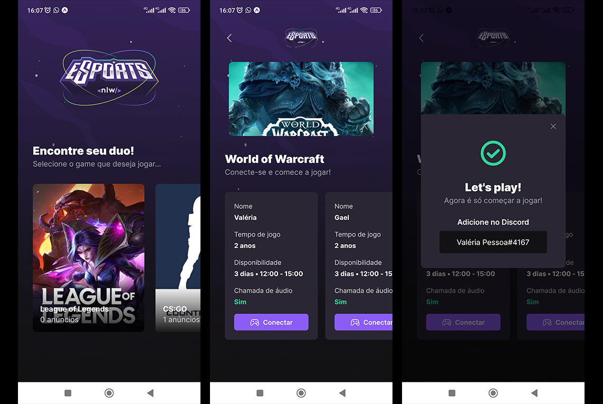

<h1 align="left">Projeto NLW</h1>

Criação de uma plataforma para encontrar seu duo!

Plataforma que ajuda gamers a encontrar um parceiro ou parceira para jogar online seu game favorito, conectado a Twitch. Desenvolvido em web e mobile.

## Tecnologias
<ul>
  <li>TypeScript</li>
  <li>React</li>
  <li>React Native</li>
  <li>Tailwind CSS</li>
  <li>HTML</li>
  <li>Prisma</li>
  <li>Expo</li>
  <li>Vite</li>
</ul>
 

<h1 align="left">Web</h1>

  

  

<h1 align="left">Mobile</h1>

  

